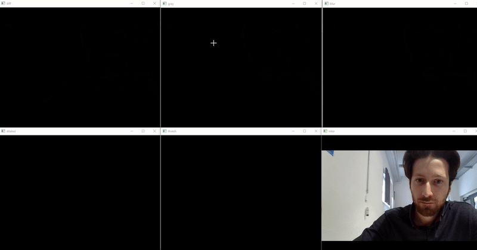

# Computer Vision-fundamentals-with OpenCV
These practices contain image processing with the OpenCV library written in Python. The tutorials are partly from the Youtube Chanel ProgrammingKnowledge. Definitly check his videos for in depth explanations: <br />
https://www.youtube.com/c/ProgrammingKnowledge/

# Overview
- Import Cameravideo
- Line Drawing in video
- Morphological Transformation
- MouseEvent Coordinate
- Movement Detection
- Reduce Resolution
- Split&Merge
- Text on Video
- Treshholding
- Trackbar & Switch
- Tracking based on Color
- Camera based Localization
- Advanced Object Tracking

# 1.) Import Cameravideo
This is the basic code importing video from an USB port and displaying it in an while loop. 


# 2.) Line Drawing in video
These Script shows how to draw lines in an video with the cv2.line function. The exact coordinates of the points has to be given into the function. The third parameter defines the color and the fourth one the thickness of the lines.<br /> Heres one example:<br />
```cv2.line(frame,points[-1], points[-2], (255,0,0), 5)``` <br />
Note that you have to click on 5 points before its starts to draw the lines.
# 3.) Morphological Transformation
Morphological Transformation is used to abstract shapes, figures and structures in an image.[1] In this example we take a look at this picture of smarties and try to abstact them: <br />
 <br />
Fristly we will threshhold the image to filter the background. The image is stored as _mask_ <br />
```_, mask=cv.threshold(img, 220, 255, cv.THRESH_BINARY_INV)``` <br />
The resulted image _mask_ looks good for now, but contains white spots due to the lighint in the picture. To smooth them out, we can dilate and/or erose them: <br />
```dilation=cv.dilate(mask, kernal, iterations=3)``` <br />
```erosion= cv.erode(dilation, kernal, iterations=3)``` <br />
The result can be seen here: <br />
 <br />


# 4.) MouseEvent Coordinate
Often we will have to interact within the video. In this script we will take a look on how to store the coordinates of a mouseclick by utilizing this OpenCV function: <br/>
```cv2.EVENT_LBUTTONDOWN``` <br />
# 5.) Movement Detection
In this section we're going to look how to detect moving objects in a video. We will take a look at the output image on every step to see the results and get an idea what the function actually does. <br/>
The frist thing we do is loading two frames on every iteration and substracting them with the function <br />
```diff=cv.absdiff(frame1, frame2)``` <br />
By doing this, we get only the pixels that are changing. Then we convert the image to a grayscaled one as we dont need the colour and do some blurring and threshholding afterwards. With the threshholding and dilating function we're trying to higlight the contours of that moving object
```_, thresh=cv.threshold(blur, 20, 255, cv.THRESH_BINARY)``` <br />
```dilated=cv.dilate(thresh, None, iterations=3)``` <br />
At the end we can find the contours and draw a rectangle over that. Note that we specify a certain area of the contour to be filteres out to reduce the noise.
```for contours in contours:``` <br />
```        (x,y,w,h)=cv.boundingRect(contours)``` <br />
```        if cv.contourArea(contours)<7000:``` <br />
```            continue``` <br />
```        elif cv.contourArea(contours)>100000:``` <br />
```            continue``` <br />
```        cv.rectangle(frame1, (x,y), (x+w, y+h), (0,255,0), 2)``` <br />
```        cv.putText(frame1, "Status: Movement", (10,20), cv.FONT_HERSHEY_SIMPLEX, 1, (0,0,255), 3)``` <br />


# 6.) Reduce Resolution
# 7.) Split&Merge
# 8.) Text on Video
# 9.) Treshholding
# 10.) Trackbar & Switch
# 11.) Tracking based on Color
# 12.) Camera based Localization
# 13.) Advanced Object Tracking
# 14.) References
[1] https://lmb.informatik.uni-freiburg.de/lectures/praktika_brox/bvpraktikum/BVAnl_morphologie.pdf
